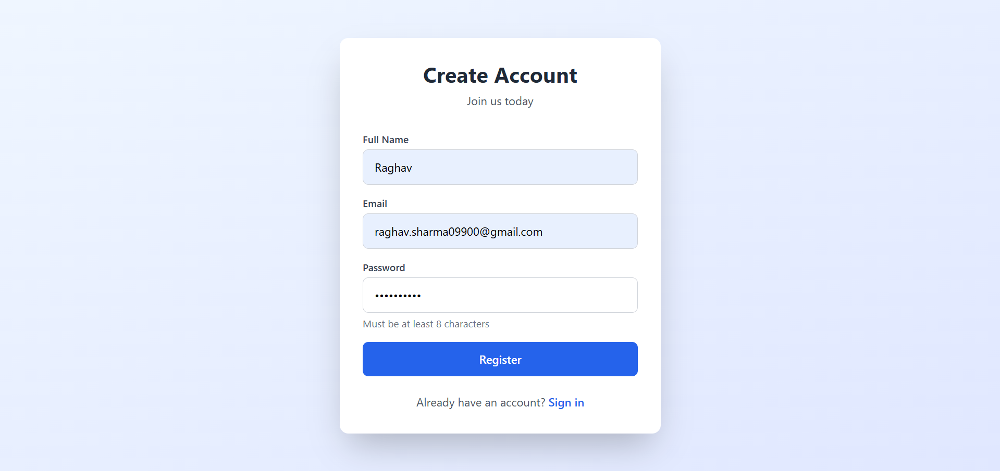
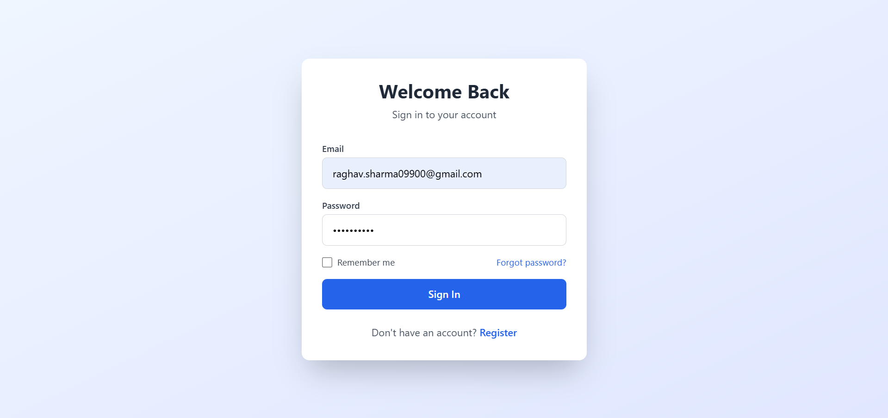
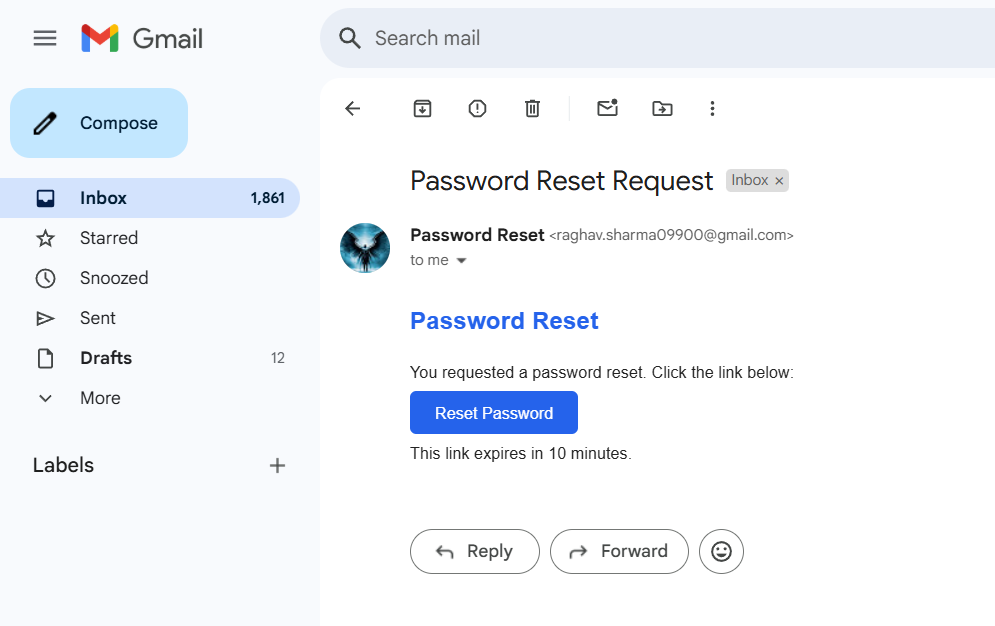
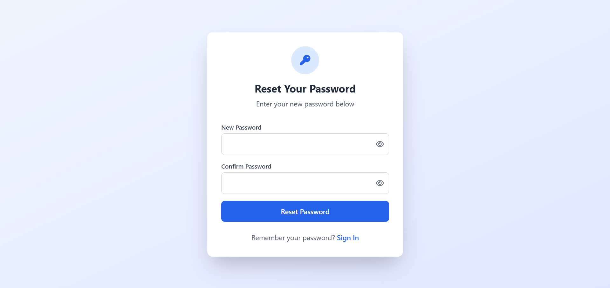
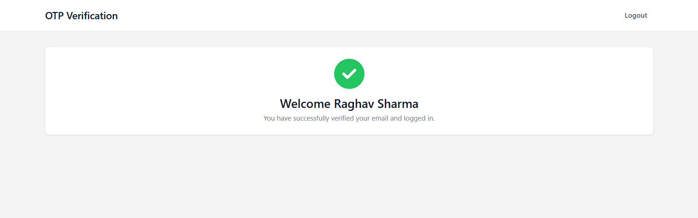

# 🔐 OTP Verification App

A secure and modular Node.js application for email-based OTP authentication. It supports user registration, login, OTP verification, and password reset via email.

---

## 📸 App Screenshots

### 📝 Register Page


### 🔐 Login Page


### 📩 OTP Verification


### 🔁 Reset Password (Request Link)


### 🔁 Reset Password (Enter New)


### 🔒 New Password Page


### 🧭 Dashboard (After Login)



## 📁 Folder Structure

```
OTPVerification/
├── config/               # DB config
├── controllers/          # Logic controllers
├── middleware/           # Auth middleware
├── models/               # User & session schema
├── public/
│   ├── css/
│   ├── images/           # Screenshots (used in README)
│   └── js/
├── routes/               # Routes for auth
├── views/                # HTML frontend pages
├── .env
├── app.js
├── package.json
└── README.md
```

---

## ⚙️ Technologies Used

- **Node.js** + **Express.js**
- **MongoDB** + **Mongoose**
- **Nodemailer** (email service)
- **express-session** + **connect-mongo**
- **Vanilla HTML/CSS/JS**

---

## 🔧 Setup Instructions

```bash
# 1. Clone the repo
git clone https://github.com/yourusername/OTPVerification.git
cd OTPVerification

# 2. Install dependencies
npm install

# 3. Configure environment
cp .env.example .env
# Then update `.env` with your actual credentials

# 4. Start the server
npm start
```

---

## 🛠️ Environment Variables

Create a `.env` file with the following structure:

```env
PORT=3000
MONGO_URI=mongodb+srv://<username>:<password>@cluster.mongodb.net/otp-app
EMAIL_USER=youremail@example.com
EMAIL_PASS=yourpassword
SESSION_SECRET=random_secret_here
OTP_EXPIRY_MINUTES=5
```

---

## 🧠 Features

- ✅ OTP email verification
- 🛡️ Session handling with MongoDB
- 🔄 Forgot password with OTP
- ⏳ OTP expiry timer
- 🧼 Clean HTML views and simple styling

---

## 📬 Sample Email Content

> Subject: `Your OTP Code`
>
> Message: `Your OTP for verification is: 123456. It will expire in 5 minutes.`

---

## 🚀 Future Enhancements

- Add rate limiting and CAPTCHA
- Add mobile SMS OTP (Twilio)
- Convert to EJS or React for dynamic pages
- Add user dashboard management

---

## 🤝 Contributing

Pull requests and suggestions are welcome. Please open an issue first to discuss changes.

## 📄 License

This project is licensed under the [MIT License](./LICENSE).
